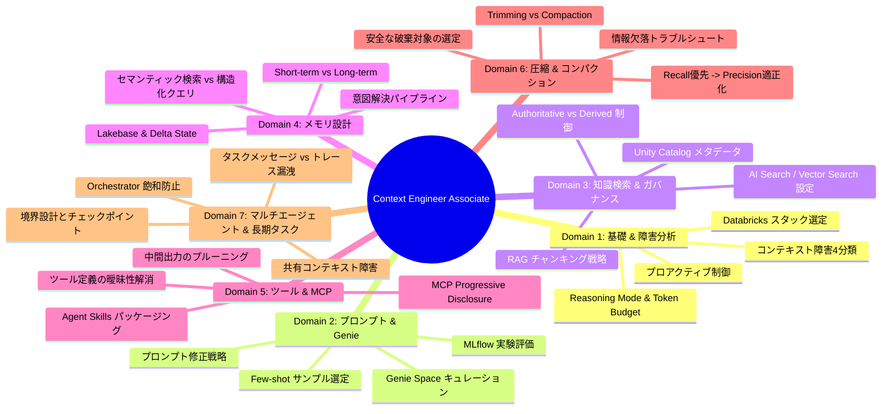

# Databricks Certified Context Engineer Associate - 試験概要 & 出題シラバス

## 1. 認定試験の概要

Databricks は 2026 年 5 月 19 日に開催された **Data + AI Summit 2026** において、業界初となるエージェント開発特化認定資格 **「Databricks Certified Context Engineer Associate」** を正式発表しました（2026 年 7 月 29 日より一般受験開始）。

AI エージェントが実験段階から本番運用（Enterprise Production）へとスケールする中で最大のボトルネックとなっているのが、推論時にモデルへ渡す情報の選別・メモリ管理・ツール連携を担う **Context Engineering（コンテキストエンジニアリング）** です。本資格は、Databricks プラットフォーム上で信頼性の高い本番級 AI エージェントシステムを構築・統制するための技術力を評価・認定します。

### 試験スペック
| 項目 | 詳細仕様 |
| :--- | :--- |
| **正式名称** | Databricks Certified Context Engineer Associate |
| **問題数** | 45 問（スコア対象外の統計収集用ダミー問題が含まれる場合あり） |
| **制限時間** | 90 分 |
| **受験形式** | オンラインプロクター監視（Webassessor / Kryterion）またはテストセンター |
| **問題形式** | 単一選択式 / 複数選択式（シナリオベースの実務問題中心） |
| **受験料** | $200 USD |
| **使用言語** | 英語（問題文中のコードは Python 主体、データ操作は SQL も含む） |
| **前提条件** | 必須要件なし（ただし Databricks Certified Data Engineer Associate レベルの知識、および 6 ヶ月以上の実務/ハンズオン経験を強く推奨） |
| **有効期間** | 2 年間（再認定には最新版試験の再受験が必要） |

---

## 2. 試験シラバス（Skills Measured）完全分類

公式 Exam Guide に基づく全 7 ドメインと測定スキルのブレークダウンです。

### Domain 1: Foundations of Context Engineering（コンテキストエンジニアリングの基礎と障害分析）
- **1.1 コンテキスト管理手法の選定**: エージェントの障害事象から、直接解決できるコンテキスト管理手法を特定する。
- **1.2 プロアクティブなコンテキスト制御**: コンパクション（要約・圧縮）が必要になる前に、最小ツールセット、JIT（ジャストインタイム）検索、ツール結果のスコープ限定などでウィンドウ圧迫を防ぐ。
- **1.3 コンテキスト障害モードの診断**: エージェントの実行トレースから以下の 4 つの障害モードを正確に診断する。
  - **Context Poisoning（コンテキスト汚染）**: 誤情報やハルシネーション結果がコンテキストに入り込み、後続ステップ全体が狂う。
  - **Context Distraction（コンテキスト注意散漫）**: 無関係な大量のトークンにより、重要な指示や情報へのアテンションが埋もれる。
  - **Context Confusion（コンテキスト混同）**: 似たツール定義や類似データ定義が存在し、モデルが誤った選択を行う。
  - **Context Clash（コンテキスト衝突）**: 指示同士やデータ同士で矛盾が存在し、エージェントがデッドロックや一貫性のない挙動を起こす。
- **1.4 Databricks プロダクトスタックの選定**: シナリオに応じて Unity Catalog, Lakebase, MCP, MLflow 3 を適切に選択する。
- **1.5 アテンションバジェット（Attention Budget）の最適化**: 不釣り合いにアテンションを消費しているコンテキスト要素を特定し、モデルの集中力を向上させる。
- **1.6 Reasoning Mode の選定**: タスク要件・トークン制約に応じて推論モード（Standard, Extended Thinking, Reduced Thinking）を判断する。
- **1.7 長期インタラクションの性能劣化への介入**: セッション長期化による検索精度や推論品質の劣化点を特定し、適切な介入を行う。

### Domain 2: System Prompt and Instruction Design（システムプロンプト・指示設計 & Genie）
- **2.1 Genie スペースのキュレーション**: ビジネスドメインに対し、指示（Instructions）、サンプル質問（Sample Questions）、信頼できる SQL 資産（Trusted SQL Assets）を統合して本番品質の Genie Space を構築する。
- **2.2 Few-shot サンプルの選定とトークンバジェット**: トークン枠内で、未知のツールパス網羅、出力構造の明示、曖昧な入力のハンドリング等、限界効用（Marginal Contribution）の高いサンプルを厳選する。
- **2.3 キャリブレーション不良プロンプトの修正**: 障害パターンから、トークン増加と保守負荷を最小限に抑えつつ修正する。
- **2.4 MLflow 実験追跡によるコスト・性能トレードオフ評価**: 実験結果を比較し、高トークン設定が妥当か、どのプロンプト要素がコストを押し上げているかを特定する。

### Domain 3: Knowledge Retrieval and Genie Configuration（知識検索 & ガバナンス）
- **3.1 Unity Catalog メタデータによる精度改善**: UC 上のテーブル・カラムコメント、アノテーション等の不足を特定し、エージェント性能に最大の影響を与える変更を加える。
- **3.2 Genie スペースへの UC オブジェクト登録**: 管理テーブル（Managed Tables）、ビュー（Views）、パラメータ化クエリ、SQL UDF の使い分け。
- **3.3 Databricks AI Search / Vector Search のトラブルシュート**: 検索精度の劣化原因（インデックス設定、ハイブリッド検索比率、埋め込みモデル）を診断・是正する。
- **3.4 UC ガバナンス下での RAG パイプライン設計**: ドキュメントコーパスからチャンクを取得し、エージェントに安全に注入する。
- **3.5 チャンキング戦略の選定**: ドキュメント構造、埋め込みモデルのコンテキスト長、クエリ特性に応じた最適な分割手法（セマンティック、階層型、固定長）の選定。
- **3.6 事前取得（Pre-inference） vs JIT（Just-in-Time）エージェント検索**: 一括先読み（Embedding ベース）と動的クエリ（Delta テーブル直接参照、ツール呼出）のアーキテクチャ上の使い分け。
- **3.7 MLflow Eval ログを用いた検索障害の特定**: 忠実度（Faithfulness）や関連度（Relevance）のメトリクスから UC ガバナンス側の対策を特定する。
- **3.8 信頼資産（Authoritative）と派生資産（Derived）の分離**: エージェントが参照する探索空間を、デプロイ前に信頼できる正規ソースに厳格に制約する。

### Domain 4: Memory Architecture with Lakebase and MLflow（メモリ設計）
- **4.1 メモリ種別と要求のミスマッチ解消**: 短期コンテキスト（インコンテキスト・スクラッチパッド、セッション履歴）と長期永続メモリ（Lakebase / Delta）の適切なマッピング。
- **4.2 Delta-backed State vs In-context Scratchpad**: 複数ステップのタスクにおいて、外部状態管理（Delta テーブル）を必須とする条件の判定。
- **4.3 Lakebase の検索方式選定**: ベクトル検索（AI Search）による類似記憶抽出か、構造化クエリ（SQL / フィルタ）による確定抽出かの使い分け。
- **4.4 コンテキスト汚染（Over-retrieval）と想起漏れ（Under-retrieval）**: メモリ検索時の精度とノイズのトレードオフ管理。
- **4.5 Lakebase を用いたクロスセッション永続化**: セッションを跨いだユーザープロファイル・長期文脈の保持設計。
- **4.6 意図解決ステージ（Intent Resolution）**: 検索クエリを投げる前に、ユーザーの真の意図や照会条件を解決・明確化する前処理パイプラインの配置。

### Domain 5: Tool Design, MCP, and Agent Context（ツール設計・Model Context Protocol）
- **5.1 MCP における Progressive Disclosure（段階的情報開示）**:
  - 全ツールスキーマの一括投入を避け、「ツール一覧・概要検索」→「必要なツールスキーマのオンデマンド取得」→「実行」へと段階化し、トークン消費を劇的に削減する。
- **5.2 ツール定義の曖昧性解消（Disambiguation）**: 説明文の重複によるツールの誤選択を防ぐための記述設計。
- **5.3 生のツール出力（Raw Output）のプルーニング**: トークン圧迫時に、不要になった中間テーブルの生データや中間 JSON を消去・要約する。
- **5.4 Unity Catalog 登録ツールの設計**: UC Functions（SQL / Python）としてツールを定義・権限管理するベストプラクティス。
- **5.5 Agent Skills へのカプセル化**: システムプロンプト肥大化を防ぎ、特定機能指示・スクリプトを「スキル」としてオンデマンドロード可能にする。

### Domain 6: Context Compression and Compaction（コンテキスト圧縮・コンパクション）
- **6.1 コンパクション障害の分析**: 要約・圧縮によって失われた決定打情報（前提条件、エンティティ ID 等）を特定し、プロンプトを改修する。
- **6.2 Compaction Tuning の大原則**:
  - **第 1 ステップ: Recall（網羅性）の最大化**（まず必要な文脈や状態変化を確実に拾い切る）
  - **第 2 ステップ: Precision（適合率）の最適化**（不要な装飾や中間推論を削ぎ落とす）
- **6.3 トリミング（Trimming） vs コンパクション（Compaction）**: 単純なスライディングウィンドウ（FIFO 削除）で耐えられるケースと、LLM による文脈要約が必要なケースの判定。
- **6.4 削除安全な要素（Safe to Remove）の特定**: 中間ツールコールの生ログ、失敗したリトライログ、冗長な挨拶等は安全にプルーニングする。
- **6.5 Aggressive（積極的） vs Conservative（保守的）圧縮のトレードオフ**: コスト削減効果と文脈喪失リスクの天秤。

### Domain 7: Multi-Agent and Long-Horizon Task Design（マルチエージェント & 長期タスク）
- **7.1 不十分な共有コンテキストによる障害**: エージェント間の意思決定の食い違いや重複実行の診断。
- **7.2 Coordinator-Worker 間のタスク伝播**:
  - 親エージェントが子エージェントに「親の全トレース」を渡してコンテキストを肥大化させるのを防ぎ、タスク特化メッセージと最小限の前提条件のみを渡す。
- **7.3 オーケストレーターのコンテキスト飽和防止**:
  - サブエージェントからの返却値を大容量生データではなく「要約レポート」や「Delta テーブル / Lakebase への書き込みポインタ（URI）」にする。
- **7.4 エージェント境界設計（Boundary Placement）**:
  - 境界が細かすぎるとハンドオフの圧縮・通信オーバーヘッドが増大し、大きすぎると単一エージェントのコンテキストが破綻するトレードオフの最適化。
- **7.5 長期タスク（Long-Horizon）のアーキテクチャ**:
  - 線形パイプライン、ステートグラフ、チェックポインティングによる耐障害性。

---

## 3. 公式リソース & 出典

- [Databricks Official: Context Engineer Associate Certification Page](https://www.databricks.com/learn/certification/context-engineer-associate)
- [Databricks Official: Exam Guide PDF (2026-07)](https://www.databricks.com/sites/default/files/2026-07/databricks-certified-context-engineer-associate-exam-guide.pdf)
- [Databricks Official: AI Certification Prep Guide PDF (2026-06)](https://www.databricks.com/sites/default/files/2026-06/ai-prep-guide-any-databricks-certification.pdf)
- [Databricks Blog: The skills gap behind agentic AI — and how Databricks is closing it (2026-05-19)](https://www.databricks.com/blog/the-skills-gap-behind-agentic-ai-and-how-databricks-is-closing-it-with-a-new-context-engineer-certification-and-agent-trainings)
- Databricks Academy 推奨コース:
  - `AI Agent Fundamentals`
  - `Building Retrieval Agents on Databricks`
  - `Agent Evaluation on Databricks`
